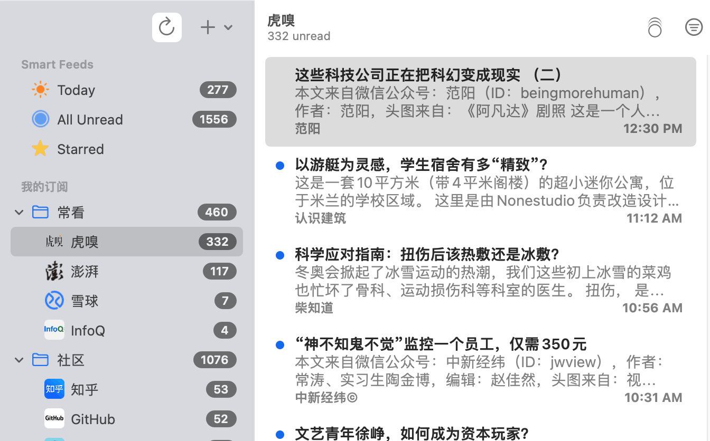
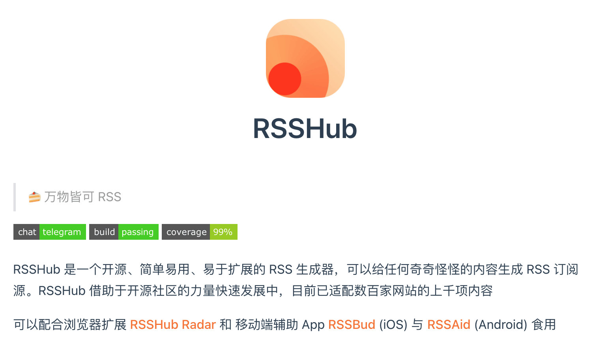

> RSS（英文全称：RDF Site Summary 或Really Simple Syndication），中文译作简易资讯聚合，也称聚合内容，是一种讯息来源格式规范，用以聚合多个网站更新的内容并自动通知网站订阅者。使用RSS 后，网站订阅者便无需再手动检视网站是否有新的内容，同时RSS 可将多个网站更新的内容进行整合，以摘要的形式呈现，有助于订阅者快速获取重要资讯，并选择性地点阅检视。 
>  -- *维基百科 https://zh.wikipedia.org/wiki/RSS*

## 为什么又开始使用RSS订阅了

在使用了大约十年的微博又换了头条之后，我最终还是把获取信息的工具换成了RSS

微博的 slogan 是 “随时随地发现新鲜事”，它的优势是获取信息非常及时，也是舆论爆发的主要场地。不过它的劣势也非常明显，信息鱼龙混杂，评论戾气很重，对立言论让人感觉摸不着头脑，整个评论区就是个罗生门

后来，感觉微博实在没什么可看的，特别是热搜无聊到明星一举一动都要上个热搜，于是我就把微博卸载换成了今日头条

头条的特点是根据你的喜好推荐你想看的内容，这样其实有利有弊，好处是不需要你去浪费时间筛选想看的内容，坏处是这样的推荐算法让会你完全成为了信息的井底之蛙。在头条关注了一些财经博主和新闻媒体，刷了一段时间的，发现头条的资讯内容大部分都是比较肤浅的快讯，没有很多深度的内容。或者说我的关注方式不对吧，总之信息很多，但都不想停留太久

RSS 在工作的几年断断续续用了很长时间，但是最后基本都是因为工具不好用放弃过一段时间，比如被墙或体验不好或功能太复杂。22年开年，权衡利弊，感觉还是 RSS 更适合我，最主要的是可以订阅一些技术周刊或者博客，之前漫无目的看头条和微博导致我对技术关注少了很多，已经跟不上社区的步伐了，感觉还是非常可惜的

虽然现在RSS订阅已经算是一个“老古董”了，很多网站或者博客已经停止服务了，但是还是有少数内容不错的网站依然提供服务，依然可以组合订阅出很好的信息流，所以 2022 年初，决定重新开始使用 RSS

## 我的 RSS 使用姿势

### 订阅工具

之前在逛社区时，无意中发现了 [NetNewsWire](https://netnewswire.com/)，一款开源的 RSS 订阅客户端，安装包很小，不过目前主要支持苹果生态的设备，使用了一段时间总体感觉还是很满意的，UI看起来比较清爽，基本功能该有的都有（如头图所示）

在使用 NetNewsWire 之前也用过 Feedly、Inoreader、 深蓝阅读 甚至最早QQ邮箱的订阅，不过现在基本已经被强了，其他的也因为用户体验不好弃用了

### 订阅资源

目前关注的内容主要是国内几个科技财经技术相关的站点和新闻网站，比如虎嗅、雪球、InfoQ 和澎湃

其他还有一些社区的内容，比如知乎、github趋势、推特、V2EX

还有几个个人博主和技术周刊，我把更新频率较慢的放在一起，怕被频率高信息源的直接淹没了，例如阮一峰的网络日志、奇舞周刊、酷壳、MacTalk等博客

视频类的我也有订阅，主要是油管的一些频道，令人高兴的事是油管频道链接直接支持订阅，非常nice!

现如今（2022年）已经有很多网站不提供RSS 订阅了，不过有个开源项目 [Rsshub](https://docs.rsshub.app/) 可以支持很多站点的抓取，并生成 feed 可以订阅，资源非常丰富并且一直在更新中**(2022年3月订阅源已被强，不过可以自己部署或者找镜像)**

还有可以转微信公众号的 feed 聚合站点：[今天看点啥](http://www.jintiankansha.me/)、[Werss](https://werss.app/),  不过都有免费订阅数量限制，更多需要买会员了

### 使用感受

通过 NetNewsWire 订阅了以上列举的一些资源之后，每天会在空余时间浏览一下，资讯类订阅的信息更新非常及时的，最喜欢的就是虎嗅的订阅，会推荐很多深度文章和精选的微信公众号文章，总体感觉质量还是非常不错的，能学到平常很难接触到的知识，比如今天读到的[《SpaceX星际飞船安全着陆，但载人登陆火星依然漫长》- 中国工程院院刊©](https://www.huxiu.com/article/499422.html?f=rss) ，我在头条或者微博应该不会主动订阅这种工程院的文章，但是通过订阅资讯类站点，经过编辑的精选我就能了解更多的知识，不会出现信息面的闭塞

虽然去找订阅资源和订阅的过程比较繁琐，但这样操作下来的结果就是，得到一个适合自己的信息流系统，能更高效的获取信息。**RSS本质来讲是反人性的，但是往往反人性的东西会带来充实**

自我感觉深度文章的价值还是高于简讯类的信息，所以在订阅源的挑选上，我会优先订阅深度文章类型的，快讯类的就会被我剔除。其实这个世界很多信息根本不需要知道，少一点纷杂的信息，内心可以多一些平静，逃离无限的 refresh 过程。引用一篇文章下面的评论，感觉说的很对： 
> 使用聚合资讯订阅就是为了有一个属于自己、可以离线阅读的聚合信息源。
要达到数字极简的目标，就需要避免受到各种在线推送算法、碎片化通知的干扰

# RSS 的发展

RSS 虽然非常好用，但是还是有很多缺陷导致了他的落寞，注定小众。

比如最重要的商业化，RSS 只是个简单资源订阅协议，无法直接让内容提供方实现盈利，也就让生产者缺少了开放 RSS 的动力

因此，内容源的缺乏也导致用户在寻找订阅源的过程中非常繁琐，劝退了很多人，我曾经也因这个原因放弃过。不过，随着 Rsshub 的壮大，目前RSS 有了一点复兴的意思，毕竟内容源的丰富程度是很关键的，决定了 RSS 的用户体验

总之，RSS 要想发展壮大还是要在商业化上进行探索，只有保障了内容提供方的利益，才能让内容方更愿意提供 feed 内容的持续输出

最近出现了基于大区块链概念的RSS3协议 [rss3.io](https://rss3.io/)，对订阅的内容增加了所有权的概念，甚至可以通过区块链对参与者进行利益的分配，这个激励机制的加入可能会促进 RSS3 应用的发展。目前来看（202202）还只是在概念阶段，甚至有炒作的情况，具体发展还是静观其变吧

看了下自己的手机，希望互联网能真正的回归到互联网的初衷吧